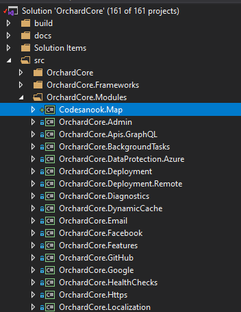
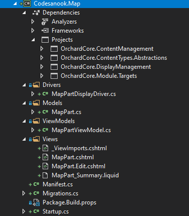
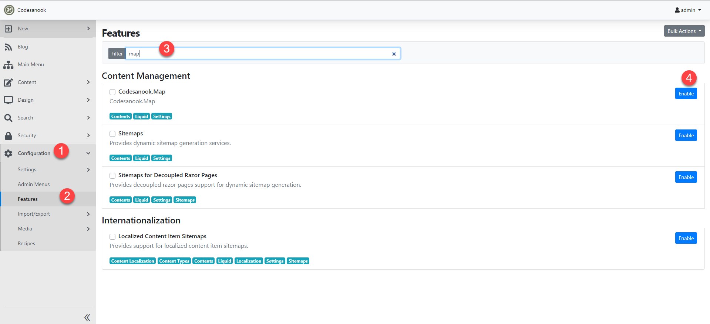
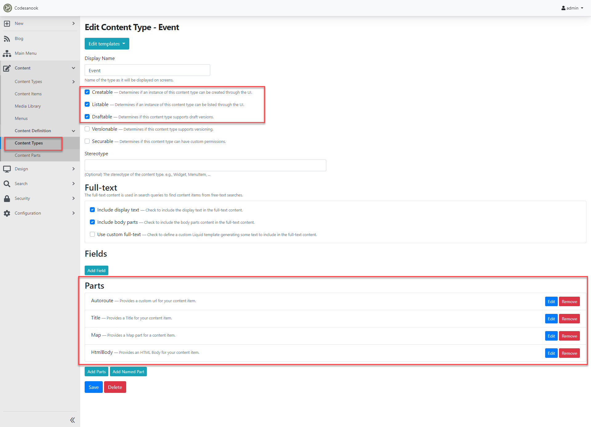
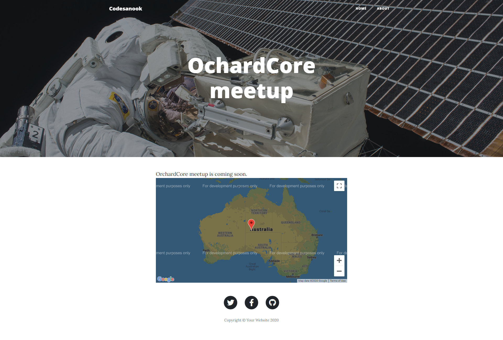

# How to create a new custom module in OrchardCore

## Main basic concept of Orchard components

To understand how to develop Orchard extension, we need to unstanderstand these terms:
Content item, Content type, Content part and Content field

### Content item

**Content** item is a single piece of content, often associate with a single URL (address) on the site.
Examples of content items are pages, blog posts or products.
With OOP concept, you can think it is **an nstant of a class**.

### Content type

**Content type** is like a class of content item.
Before creating a content type, we must define a content type first.

Those three examples that we mentioned before have these content types: page, blog post and product type.
In other words what we call a blog post is just an item of type blog post.

### Content part

In Orchard, a content type is built from multiple smaller parts, are conveniently called content parts.
A content part is an atom of content that is enough to build a specific coherent behavior and it can be reused across content types.
You can think it is group of reusable properties and we creates a new content type from multiple content parts.

Example of content parts are:

- Title part for providing title to content item
- Autoroute part for proving a custom URL for your content item.
- HtmlBody part for Providing an HTML Body for your content item.

### Content field

A Content field is a piece of information that can be added to a content type.
It has a name and a type that is specific to a content type.
A content type can have multiple content fields but can have only one content part.

For example, a product content type can have a text field representing its SKU,
a numeric field representing its price, and another numeric field representing its weight.
Each of these fields probably only makes sense on a product type.

## Define a new content type

In our example, we want to create a web page to show an event information.
The page will have the following information:

- A custom friendly URL from event's title
- Event's title
- HTML Body for event details
- Map for event's location

Therefore, we will create a new **Event content item** from **Event content type**.
Let's define our Event content type.
It will consist of these parts:

- Autoroute part
- Title part
- HtmlBody part
- Map part

Autoroute, Title, HtmlBody are existing parts in Orchard CMS.
They are in OrchardCore.Autoroute, OrchardCore.Title, OrchardCore.Html projects (modules) respectively.
However, we don't have a built-in Map part so we need create a new one.

## Create a new module project from a dotnet tool

Let's create a new module for Map part.
A module is a set of extensions for Orchard that are grouped under a single sub-folder of the **OrchardCore.Modules.Cms** directory.
Actually it is just a ASP.NET MVC Core project.
We don't need to create it manually, we can use **dotnet tool** to create a module with a scaffold content part for us.

Follow these steps to create a new module project.

- Install .NET Core 3.1 from https://dotnet.microsoft.com/download/dotnet-core/3.1
- Launch a new PowerShell session and use the following command to install a new project template.

```
dotnet new -i OrchardCore.ProjectTemplates::1.0.0-rc2-* --nuget-source https://nuget.cloudsmith.io/orchardcore/preview/v3/index.json
```

- CD to a folder that you want to save OrchardCore source code
  and then clone a project's source code if you haven't had Orchard on your local machine.

```
git clone git@github.com:OrchardCMS/OrchardCore.git
```

- CD to OrchardCore CMS 's module folder

```
cd OrchardCore/src/OrchardCore.Modules
```

- Create a new module with a name that you want.
  In this example, we are going to create "Codesanook.Map" module for providing Map part
  which can be used in event content type

```
dotnet new ocmodulecms --name Codesanook.Map --AddPart True --PartName Map
```

_Note_ **Part** suffix is appended automatically to the end of the supplied PartName.

## Update a module project

- Open OrchardCore.sln which is in the root folder with Visual Studio.
- Include the existing project Codesanook.Map which is under OrchardCore.Modules folder to the solution.
- In Codesanook.Map, remove the following packages and add them as projects reference.

```
OrchardCore.ContentManagement
OrchardCore.ContentTypes.Abstractions
OrchardCore.DisplayManagement
OrchardCore.Module.Targets
```

screenshot of the module project after including to the solution under OrchardCore.Modules folder



- Go to **OrchardCore.Application.Cms.Targets** project which is under **src/Targets** folder and add **Codesanook.Map** as a project reference.
  This will include our project as part of a website modules.
- Open OrchardCore.Application.Cms.Targets.csproj file and add attribute PrivateAssets="none" to ProjectReference element of Codesanook.Map.
- Save all changes

Here is Codesanook.Map reference code in OrchardCore.Application.Cms.Targets.csproj.

```

<ProjectReference Include="..\..\OrchardCore.Modules\Codesanook.Map\Codesanook.Map.csproj" PrivateAssets="none"/>

```

## Restore all nuget packages

- CD src/OrchardCore.Cms.Web and run the following command
- _Note_ Please make sure you save all changes before running the command.

```
dotnet restore
```

## Launch Orchard website

CD src/OrchardCore.Cms.Web and run the following command

```
dotnet watch run
```

- Open a browser and you will find a website on https://localhost:5001

- Set up a new website have you haven't setup it, use **blog recipe**
- Use local SQL Server as database. You need to create an empty database in your local SQL Server before setting up a website.
- Here is an example of SA connection string _"Server=localhost;Database=Codesanook;User Id=sa;Password=your-password"_
- Set admin username and email to what ever you want.
- Go to admin panel by nativate to https://localhost:5001/admin and log in with your admin's username and password.
- Tip, you can put **chrome://flags/#allow-insecure-localhost** in Chrome's address bar, enable that setting and relanch Chrome to not show warning message on localhost.
- On the left-hand side menu, Go to Configuration > Features
- Search for **Codesanook.Map** and you will find it has not been enable yet.
- We will be back to enable it later after we have updated our module and our Map part is ready to use.

## Update Map Mart

- You can update Manifest file as you prefer. I will only change Author and Website.
- Edit Manifest.cs in Codesanook.Map project to:

```
using OrchardCore.Modules.Manifest;

[assembly: Module(
    Name = "Codesanook.Map",
    Author = "Codesanook Team",
    Website = "https://www.codesanook.com",
    Version = "0.0.1",
    Description = "Codesanook.Map",
    Dependencies = new[] { "OrchardCore.Contents" },
    Category = "Content Management"
)]

```

- Go to the Model folder (Codesanook.Map/Modules), you will find that we have the generated MapPart.cs file.
  This file is our main model. It is a content part that we will add feature.
- Add new properties to the model and it will look like this.

```
using OrchardCore.ContentManagement;

namespace Codesanook.Map.Models
{
    public class MapPart : ContentPart
    {
        public double Latitude { get; set; }
        public double Longitude { get; set; }
    }
}
```

- Please notice that a content part derives from **ContentPart** class.

## Update ContentPartDisplayDriver

You can think ContentPartDisplayDriver class is a mini MVC controller to display, edit our content part.
To use it, we create a derived class of ContentPartDisplayDriver with a generic type of our content part.

- Go to Drivers folder and you will find we have MapPartDisplayDriver.
  There are three main method that we need to override Display/DisplayAsync, Edit/EditAsync and Update/UpdateAsync
  All methods have pairs of async method that we can override.
  - **Display/DisplayAsync** for creating a shape to render a part in frontend
  - **Edit/EditAsync** for creating a shape to render a part as editing form
  - **Update/UpdateAsync** for updating a part with a new value

## What is a content shape?

It is a small object that contains all the information required in order to display on the screen.
Before showing a content item, everything get mapped into a tree of shapes that is a sort of abstract representation of the contents of the final page.

The advantage of such trees of shapes is that any module can modify existing shapes or create a new one.

In MapPartDisplayDriver.cs in Display method. We create a IDisplayResult by using Combine method.
This method combine two shapes which is **MapPart shape** for showing map in details page
and **MapPart_Summary shape** for showing map part in summary (list page)

We return two shapes and Orchard know how to render it correctly depend on display type Details or Summary.

Let's dig into how we create a MapPart shape.

```
    Initialize<MapPartViewModel>(
        "MapPart",
        m => BuildViewModel(m, MapPart)
    ).Location("Detail", "Content:20"),

```

Signature of Initialize method

```
    public ShapeResult Initialize<TModel>(string shapeType, Action<TModel> initialize)
```

We use Initialize method with a generic of view model "MapPartViewModel"
that will be passed to a view template of shape type "MapPart"
and we construct a Lambda to create a view model with BuildViewModel method.

Orchard uses convention to bind a view template (\*.cshtml or \*.liquid) and shape name.
Given our shape type **MapPart**, it will be use **MapPart.cshtml** or **MapPart.liquid** in Views folder to render a shape.

Therefore, we will have MapPart.cshtml with MapPartViewModel as a model that we can use to adjust our view when display a content part in details page.

## Update MapPartViewModel

- Go to MapPartViewModel.cs and update the content as following:

```
using Microsoft.AspNetCore.Mvc.ModelBinding;
using OrchardCore.ContentManagement;
using Codesanook.Map.Models;

namespace Codesanook.Map.ViewModels
{
    public class MapPartViewModel
    {
        public double Latitude { get; set; }
        public double Longitude { get; set; }

        [BindNever]
        public ContentItem ContentItem { get; set; }

        [BindNever]
        public MapPart MapPart { get; set; }

    }
}

```

- Go back to MapPartDisplayDriver.BuildViewModel method and update the method body as following:

```
    private void BuildViewModel(MapPartViewModel model, MapPart part)
    {
        model.Latitude = part.Latitude;
        model.Longitude = part.Longitude;
        model.MapPart = part;
        model.ContentItem = part.ContentItem;
    }

```

As you can see, we move the part properties to root level properties, reference to original part object and reference to a content item that this part belong to.

## Edit MapPart.cshtml

- Rename MapPart.liquid to MapPart.cshtml, we will use Razor instead of Liquid template.
- Update the content of MapPart.cshtml as following:

```
@model MapPartViewModel

@{
    // From https://developers.google.com/maps/documentation/javascript/adding-a-google-map
    var apiKey = "YOUR_API_KEY";
}

<!--The div element for the map -->
<div id="map"></div>

<style type="text/css">
    /* Set the size of the div element that contains the map */
    #map {
        height: 400px;
        /* The height is 400 pixels */
        width: 100%;
        /* The width is the width of the web page */
    }
</style>

<script src="https://maps.googleapis.com/maps/api/js?key=@apiKey&callback=initMap&libraries=&v=weekly" defer></script>
<script>
    // Initialize and add the map
    function initMap() {
        // The location of Uluru
        const uluru = { lat: @Model.Latitude, lng: @Model.Longitude };
        // The map, centered at Uluru
        const map = new google.maps.Map(
            document.getElementById("map"),
            {
                zoom: 4,
                center: uluru,
            }
        );

        // The marker, positioned at Uluru
        const marker = new google.maps.Marker({
            position: uluru,
            map: map,
        });
    }
</script>

```

- Get Google map API key from https://developers.google.com/maps/documentation/javascript/adding-a-google-map#step_3_get_an_api_key
  and change text "YOUR_API_KEY" to your Google map API key.

- Update content of MapPart_Summary.liquid to:

```
<a href="{{ Model.ContentItem | display_url }}>{{ Model.ContentItem.ContentItemId }}</a>
```

We are done with display part of our Map content part.

## Update Edit method and its view.

- Update MapPartDisplayDriver.Edit as following:

```
    public override IDisplayResult Edit(MapPart MapPart)
    {
        return Initialize<MapPartViewModel>(
            "MapPart_Edit",
            m => BuildViewModel(m, MapPart)
        );
    }


```

This method create a **MapPart_Edit shape** that will use MapPart_Edit.cshml for editing page of Map content part.

- Go to MapPart_Edit.cshml and update the content as following:

```
@model MapPartViewModel

<h3>Location</h3>
<div class="form-group" asp-validation-class-for="Latitude">
    <label asp-for="Latitude">
        @T[nameof(Model.Latitude)]
    </label>
    <input asp-for="Latitude" class="form-control" />
</div>

<div class="form-group" asp-validation-class-for="Longitude">
    <label asp-for="Longitude">
        @T[nameof(Model.Longitude)]
    </label>
    <input asp-for="Longitude" class="form-control" />
</div>

```

## Update UpdateAsync method and its view.

- Update MapPartDisplayDriver.UpdateAsync as following:

```
    public override async Task<IDisplayResult> UpdateAsync(MapPart model, IUpdateModel updater)
    {
        await updater.TryUpdateModelAsync(
            model,
            Prefix,
            t => t.Latitude, t => t.Longitude
        );

        return Edit(model);
    }
```

This method use updater.TryUpdateModelAsync to update our Map part and save to a database by taking HTTP form data as input.
We explicit update only Latitude and Longitude properties.
It will return the shape result of Edit method which is MapPart_Edit shape.
Therefore, this method will end up with returing the edit page with a new content from a database.

## Update a startup.cs file

- Update a Startup.cs file to:

```

using Microsoft.Extensions.DependencyInjection;
using OrchardCore.ContentManagement;
using OrchardCore.ContentManagement.Display.ContentDisplay;
using OrchardCore.Data.Migration;
using Codesanook.Map.Drivers;
using Codesanook.Map.Models;
using OrchardCore.Modules;

namespace Codesanook.Map
{
    public class Startup : StartupBase
    {
        public override void ConfigureServices(IServiceCollection services)
        {
            services.AddContentPart<MapPart>().UseDisplayDriver<MapPartDisplayDriver>();
            services.AddScoped<IDataMigration, Migrations>();
        }
    }
}

```

## Create an Event content type

We have a Migrations.cs at root of the project for doing that.
We have generated code which already create a part for us.
We use contentDefinitionManager.AlterPartDefinition to create a part with a part name matches our part model.

Since OrchardCore stores data of MapPart in JSON document format, so we don't need to define any tables/columns like Orchard version 1. With this, our migration is much simpler.

```
    public class Migrations : DataMigration
    {
        IContentDefinitionManager _contentDefinitionManager;
        public Migrations(IContentDefinitionManager contentDefinitionManager) => _contentDefinitionManager = contentDefinitionManager;

        public int Create()
        {
            _contentDefinitionManager.AlterPartDefinition(
                nameof(MapPart),
                part => part
                    .Attachable()
                    .WithDescription("Provides a Map part for a content item.")
            );

            return 1;
        }
    }

```

## Remove unused files

- Remove Handlers folder and files inside, we don't need them for our project. Learn handler more.
- Remove MapPartDisplayDriver.GetMapPartSettings method. Learn content part settting.
- Remove Settings folder that we don't use setting in this example.
- Remove MapPartSettings.Edit which a view of content part setting.
- Remove Controller folder.
- Remove Views/Home folder.

screenshot of project structure



## Enable the module that contains Map part

Now we have a MapPart is ready to use.
In our example, we are going to create the Event content type.
We can attach the Map content part to the content type via code or UI in the admin.
To simplify our example, we will start by using admin panel.
Before using Map part, we need to enable Codesanook.Map module.

- Go to admin panel on left-hand side menu > click Configuration > Features > Search "Map" > Click enable.
- Verify if you have Map part ready to use by clicking Content menu > Content Definition > Content Parts.
- Search "Map" and verify if you have Map content part.

screenshot of steps to enable a module



## Create the Event content type and attach the Map part

- Go to admin panel.
- On the left-hand side menu.
- Click Content > Content Definition > Content Type.
- On top right corner of the screen, click "Create new type" > Name it "Event" > Click create button.
- Check the following options.

  - Creatable
  - Listable
  - Draftable

- Leave other options a default.
- Click **Add Parts** button at the bottom of the screen and add the following parts:

  - Autoroute
  - Title
  - Html Body
  - Map

- You can sort the order of parts by drag and drop.
- Click Save

screenshot of Event content type definition



## Create a new **Event content item**

- On left-hand side menu > Click New > Event.
- Then you will have a form to create a new event, fill information to all fields

  - Title
  - HtmlBody content (It use shortcode by default)
  - Lat Long to e.g. lat -25.344, lng 131.036

- Click Publish button
- You will be redirected to a content item list page, click view button to view the event you just created on frontend.

screenshot of event content item details page



## Summary

I hope this tutorial will help you understand how to create a custom OrchardCore module and content part.
Thanks.

## References

- Content adjusted from https://docs.orchardproject.net/en/latest/Documentation/Writing-a-content-part
- http://www.ideliverable.com/blog/a-closer-look-at-content-types-drivers-shapes-and-placement
